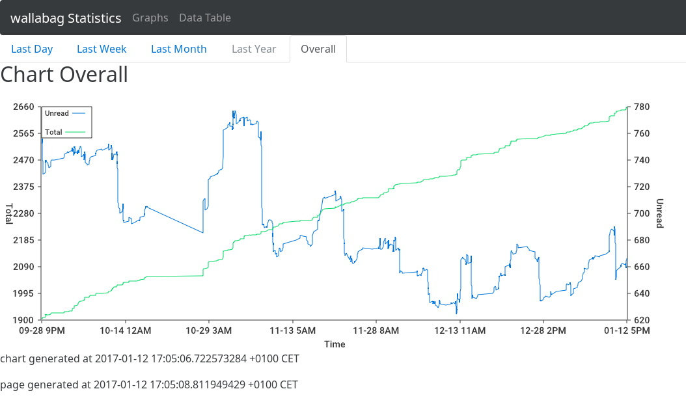

# wallabag-stats

Draws a chart for unread and total articles in your [wallabag](https://github.com/wallabag/wallabag/) instance.

Chart is only created when there at least two data sets, in which unread and total are both different compared with their previous value. Otherwise, if the delta is zero, the go-chart lib does not print a chart.

## Example



## Install

Copy `example/config.json` along with your wallabag-stats binary and change it according to your wallabag instance.

### Updates via Cron

You can install a cronjob to fetch the stats data from your wallabag and let the graph being printed on changes. E.g. a user cronjob line by editing your cronjob file via `cronjob -e`:

```
* * * * * cd /home/$USER/opt/wallabag-stats/ && ./wallabag-stats && cp chart.png /var/www
```

### Updates via systemd Timer

TODO :)

## wallabag-stats -h

```
Usage of wallabag-stats:
  -chart string
    	file name to put the chart PNG (default "chart.png")
  -config string
    	file name of config JSON file (default "config.json")
  -d	get debug output (implies verbose mode)
  -data string
    	file name of data JSON file (default "data.json")
  -v	print version
  -verbose
    	verbose mode
```

## Links to chart libs

- https://github.com/wcharczuk/go-chart
- http://bl.ocks.org/mbostock/3943967 from https://github.com/d3/d3/wiki/Gallery


## Project Status
### Go Report Card

[](https://goreportcard.com/report/github.com/Strubbl/wallabag-stats)


### Travis CI

[](https://travis-ci.org/Strubbl/wallabag-stats)
